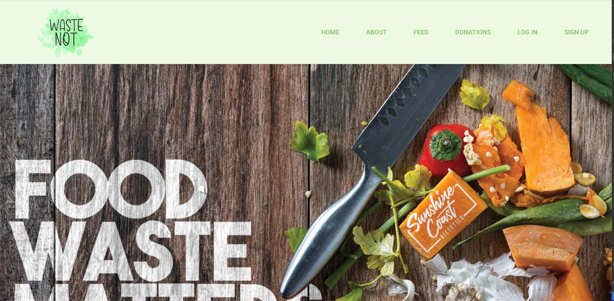

# Waste Not! 

Waste Not! provides a platform where users can post food that they will unlikely eat in an effort to reduce food waste.

By Kylie Gilbert, Luis Debourg and Peter O'Callaghan.

## Table Contents
* [Description](#description)
* [Technologies Used](#technologies-used)
* [Screenshot](#screenshot)
* [User Story](#user-story)
* [Acknowledgments](#acknowledgments)
* [Contact](#contact)

## Description
Users are able to login and post unwanted food to a platform. If they want to collect food they can click the checkbox and it will be removed from the feed.

## Technologies Used
* HTML
* CSS
* Javascript
* Node
* MongoDB
* Mongoose
* React
* Bcrypt
* GraphQl
* JWT Authentication

## Screenshot

## User Story
As a user I would like to sign up for an account
As a user I want to be able to post food to the feed
As a user I want to be able to be able to get food easily
As a user I want to be able to see the food name, description, ingredients, picture and expiry
As a user I want to be able to log in again easily

## Room for improvement
The app does need a feature that allows users to add their location.

## Contact
[Kylie Gilbert](https://github.com/kyliegilbert)
 
[Luis Debourg](https://github.com/FadesOner)
 
[Peter O'Callaghan](https://github.com/pocall23)